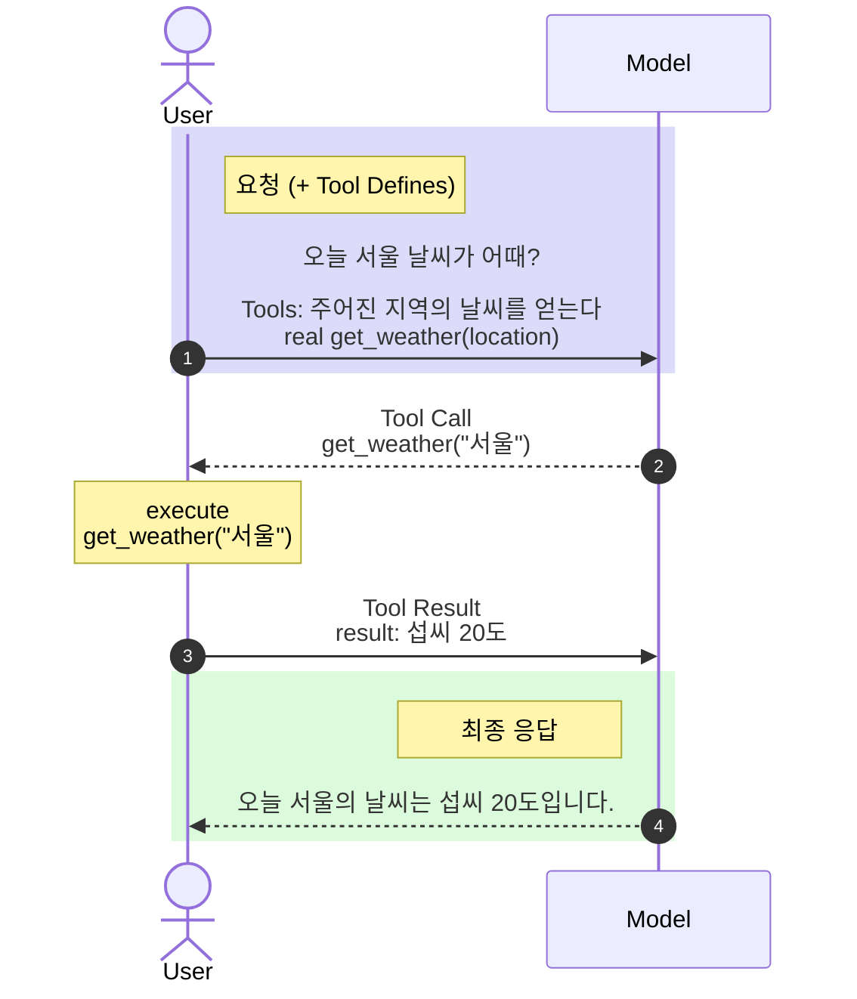

# 최신 AI 개발 요소들의 기술 베이스

## 180도 뒤집히는 패러다임의 소용돌이

최근 AI 관련 신기술들이 쏟아져 나오고 있다. 개발자들이 이를 따라가기가 벅찬 수준이다. 계속 튀어나오는 이해하기 힘든 새로운 용어들 때문에, 새로운 입자들이 계속 발견되던 과거 입자물리학계에서 나온 유명한 한탄인 ‘이건 또 누가 주문한 거야?(Who ordered that?)’ 라는 말이 요즘 개발자들 사이에서도 터져 나온다. LLM이라는 생소한 용어가 튀어나오자마자 아마도 제일 처음 접하ㅁ게 된 용어가 RAG와 VectorDB였을테고, 이후 LangChain, LangGraph 등의 프레임웍이었을테고, 비슷한 시기에 Agent라는 용어도 접하기 시작했을 것이다. 새로운 용어와 기술들조차 소화하기 힘들었던 시절에 어느 순간 MCP라는 용어가 튀어나와 AI 세계를 호령하기 시작했다. 그게 뭔지도 모르면서 MCP가 AI의 가장 중요한 해답인 양 영업이 되고 있던 시기에 이번엔 Harness가 가장 중요한 키워드가 되었고, 어느 순간부터는 AGENTS.md가 가장 중요한 개발 키워드로 떠올랐다. 이거 하나만 잘 하면 미래에 밥 굶을 일 없다라는 식으로 개발자들의 관심을 끌더니, 어느새 AGENTS.md 보다는 SKILL.md 쪽이 더 관심을 독차지 하고 있다. 전체 작업을 한곳에 기술하는 Fat -agent보다는 개별 동작을 Micro-skill로 기술하고 agent는 이를 Triggering링 하는 내용을 기술하는 것이 더 효과적이라는 것이 확인되고 있다.

이런 변화들을 보면 정말 정신이 하나도 없다. 단순히 새로운 것들이 많아서 따라가기 힘든 것이 아니다. 개발자들을 정말 힘들게 만드는 것은 패러다임의 변화가 너무 극심하다는 것이다. 즉, 새로운 기술이 아니라 이미 존재하는 기술의 패러다임이 변하는 것이 문제인 것이다. 바로 엇그제까지 내가 알고 있던 지식이 갑자기 잘 못 된 것이 되어 버린다는 인지부조화, 그것도 세월의 변화에 따라 점진적으로 변하는 것이 아닌, 단시간 내에 180도 변해 버리는 수준이기 때문이다. 이것이 바로 개발자를 정말 혼란스럽게 만들고 있다.

일례로, 초기에 LLM 활용에 있어 가장 중요한 변수로 꼽히던 RAG는 이제 적어도 개발툴에서는 더 이상 큰 관심의 대상이 아니다. 프롬프트 생성 전단계에서만 작용하여 오직 사용자 쿼리에만 의존하여 자료를 찾는 RAG보다는, 응답 과정에서 LLM의 판단에 따라 MCP를 사용하여 사후에 직접적으로 연관성이 강한 자료를 검색하는 것이 더욱 유용하다고 보는 것이다. 실제로 최근의 하네스(Harness)를 중심으로 한 개발툴들 상당수가 아예 RAG를 지원을 하지 않는 경우도 많으며, 이것에 대해 딱히 불만을 가지는 유저도 없다.

개발 방법론도 Vibe에서 Determinism으로 옮겨갔다. 한때 미래의 핵심적인 개발 방법론이 되어 개발자 직군 자체의 멸종을 유발할 것으로 예상되었던 바이브 코딩은 이제는 토큰을 낭비하는 주범으로 몰려서 퇴출 위기다.

길고 상세한 AGENTS.md가 가장 이상적인 기술 방법으로 거론되던 시기가 있었으나 불과 몇 달만에 그건 절대 해서는 안 되는 금기시 되는 등, 180도 변해 버렸다. 한때 많은 이들이 매직 프롬프트가 존재할 거라고 믿고 그걸 찾으려는 노력들이 이어졌는데, 그 중 일부는 실제로 그걸 찾았다고 주장하는 사람들도 있었다. 하지만 지금은 그건 무척 한정 상황에서만 유효할 뿐, 대부분의 경우엔 오히려 비효율을 유발하는 것으로 판명되었다.

한때 LLM과 잦은 인터랙션을 전제로 한 프롬프트 엔지니어링이 미래에는 전분야의 핵심 역량이 될 거라고 지극히 당연시 되는 분위기였으나, 이제는 단순 프롬프트 조작만으로는 원하는 것을 얻기 힘들고, 대신 사전에 잘 설계 된 준비 작업을 통해 최소한의 인터랙션으로 원하는 결과물을 얻는 하네스 엔지니어링으로 바뀌었다.

한때 토큰을 많이 쓰면 쓸수록 유능한 개발자라고 추켜세우며 개인별 토큰 사용량 순위를 사내 게시판에 게시하며 포상 기준으로 삼던 것이 불과 몇 달 전인데 지금은 또 어떤가? 생각 없이 AI에게 던진 부주의한 지시로 불필요하게 토큰을 낭비하여 기업의 지출 비용을 증가시키는 무능한 사람으로 손가락질 받는 분위기로 변해 가고 있지 않은가?

만약 열심히 공부하고 또 실습도 해서 이렇게 나온 기술들을 다 따라갔다고 치자. 그럼 그동안 수고하셨습니다, 남은 평생 그거 우려먹으며 살면 됩니다, 앞으로는 편하게 꽃길만 걸으세요라고 할까? 그 대답은 아주 높은 확률로 No일 것이다. 아마 그때 쯤엔 또다른 신기술이 튀어나와서 ‘이건 또 누가 주문한 거야!’라는 짜증이 튀어나오게 만들 것이다. 그럼 언제까지 빅테크들이 앞장서 이끄는대로 다만 우리는 따라가기만 해야 하는 걸까? 우리가 이 분야에서 선도할 수 있는 기회가 과연 주어지기는 할까?

## 거인의 어깨 아래서 느끼는 패배감의 실체

이런 패배감은 우리가 LLM 중, Base Model을 만들지 못 한다는 것에서 기인한다. 이미 익히 알려진 바와 같이, Base Model을 만드는 것은 우리의 능력을 아득히 초월한 영역이다. 그 기술적 베이스가 문제가 아니라 그것이 확보된 후에도 쓸만한 결과물을 만들어 내기 위해 어마어마한 시간과 인력과 천문학적인 비용이 들어가기 때문이다. 때문에 AI 관련 기술의 선도는 감히 꿈도 꾸기 힘들다 생각하여 아예 처음부터 시도도 하지 않고 포기하게 되는 것이다.

앞서 말했다시피, 베이스 모델을 만드는 것은 우리의 영역이 아니다. 그럼 그걸 제외한 다른 영역은 어떨까? 베이스 모델이 아니라 튜닝 모델 정도를 생각해 볼 수 있을 것이다. 하지만 튜닝 모델 역시도 베이스 모델만큼은 아니지만 역시 만만찮은 비용과 기술을 필요로 한다. 이마저도 손 대기 힘들다면 아예 모델을 만드는 영역은 일개 개발자들의 몫이 아니라고 깨끗이 포기하게 될 터이다. 그럼 나머지 부분은 어떤가? 앞서 한바탕 나열했던 각종 기술 용어들을 만들어 낸 것은 대부분 모델을 만들었던 빅테크 기업들이다. 그러니 그만큼 AI와의 기술 친화적인 면이 많기에 역시 고수준의 기술을 필요로 하는 것처럼 보인다. AI 자체를 만들어 내는 수준의 기술력을 가진 곳에서 그에 종속 된 부가적인 기술도 선도하는 것이 당연해 보인다.

하지만 그렇게 지레짐작하고 포기하는 것이 과연 옳은가? 그동안 우리를 괴롭혔던 AI 관련 된 기술들이 정말 우리는 감히 시도도 못 할만큼 AI 선도하는 회사들이나 생각할만한 혁신적인 내용을 담고 있는가? 이를 알려면 개별 기술들의 베이스를 하나하나 정리해 볼 필요가 있다.

- RAG – 전통적인 시멘틱 검색 기반. LLM과 무관.
- Tool – LLM을 보조해 주는 확장 기능.
- Agents – 기술 용어라기보다는 일반적인 마케팅 용어에 가까움. 범위가 모호함.
- MCP – Tool 기능의 확장. 단순 데이터 관리와 펑션 콜. LLM과 직접적인 상관이 없음.
- AGENTS.md – 단순 텍스트 파일 관리
- SKILL.md – Tool 기능의 확장. MCP와 유사하나 펑션이 아닌 프롬프트 파일을 대상
- Harness – 원래 사람이 AI와 인터랙션을 통해 하던 작업을 모사하여 AI가 스스로 할 수 있도록 자동화

하지만 의외로 이런 기술들의 베이스는 초기 LLM 프로토콜에서 그리 많이 변하지 않았다. 실제로 ChatGPT 4에서 사용한 프로토콜에서 최신의 기술들도 모두 잘 돌아간다. 즉, 뭔가 새로운 진보를 바탕으로 나온 기술이 아니라 이미 존재하는 기술 베이스 위에서 만들어진 응용 기술일 뿐이라는 증거다. 이는 LLM을 직접적으로 개발한 빅테크 기업이 아닌, 일반적인 회사 역시 충분히 구상했을 법 한 기술이라는 의미이기도 하다.

실제로 ChatGPT 4 에서 사용하던 프로토콜은 다음과 같다. 여기에 "tools" 필드가 존재하는데, 여기에 툴의 용도와 호출을 위한 명세를 기술하면 이후 LLM이 동작하는 과정에서 이런 툴들의 존재를 감지하고 답변에 도움이 되는 정보를 추가로 tool call 형태로 역으로 요구해 온다. MCP와 SKILL 등의 기술들이 바로 이 tool을 응용하여 구현되었다. 이외에도 앞으로 나올 모든 종류의 LLM과의 상호 작용은 이 프로토콜로 수용 가능하다. 즉, 또다시 생소한 이름으로 튀어 나올 관련 기술 용어는 십중팔구 이 tool 기능의 범주에서 벗어나지 않는다는 것이다. 실제 이를 호출하는 방법을 보면 좀 더 명확해진다.

```bash
curl https://api.openai.com/v1/chat/completions \
  -H "Content-Type: application/json" \
  -H "Authorization: Bearer $OPENAI_API_KEY" \
  -d '{
    "model": "gpt-4o",
    "messages": [
      {"role": "user", "content": "서울 날씨가 어때?"}
    ],
    "tools": [
      {
        "type": "function",
        "function": {
          "name": "get_weather",
          "description": "주어진 지역의 날씨를 얻는다",
          "parameters": {
            "type": "object",
            "properties": {
              "location": {
                "type": "string",
                "description": "지역 이름"
              },
              "unit": {
                "type": "string",
                "enum": ["celsius", "fahrenheit"],
                "description": "주어진 지역의 기온과 날씨"
              }
            },
            "required": ["location"]
          }
        }
      }
    ]
  }'
```



이 메커니즘은 최근 나온 거의 모든 기술에 공통적으로 적용된다. Tool의 집합체를 다룰 수 있게 규격화 한 것이 MCP이고, Tool의 내용에 함수 호출이 아니라 세부 지침 프롬프트 검색으로 대체한 것이 SKILL이다. 그리고 이런 메커니즘을 통합한 것이 하네스이다. 즉, 최신의 복잡다단한 신기술들은 대부분 극히 단순한 메커니즘의 확장 및 응용에 불과하다는 것이다. 그리고 이는 어느 정도 능숙한 개발자라면 큰 어려움 없이 이해 가능한 범주의 기술들이다.

실제로 OpenAI의 프로토콜의 변화 이력을 보면, 이 내용이 최근까지도 거의 변화가 없음을 알 수 있다. (https://developers.openai.com/api/docs/changelog) 사실 이는 초창기인 GPT-4 때와 비교해도 큰 차이가 없다. 단지 프로토콜에 사용 된 니모닉이 "functions"에서 "tools"로 바뀐 수준의 미미한 변화이다. 즉, 초기부터 이후에 나온 여러 AI 관련 feature들은 LLM이나 엔진 차원의 변화가 아닌, 모두 응용 기술이라는 것이다. 이미 있는 기능을 바탕으로 지속적으로 새로운 응용 방법을 만들어 내고 완전히 새로운 혁신인 것처럼 포장해 온 것이다. 하지만 보통 이런 과대포장은 오래지 않아 대중의 외면을 받았을텐데, 의외로 길게 살아남고 있다. 왜냐하면 이 기술들이 실제로 잘 동작하고 좋은 효과를 보이고 있기 때문이다.

무엇보다 주목해야 할 점은, 바로 이 기술들이 무척 직관적이고 단순하다는 점이다. 뒤돌이켜 생각해 보면 왜 이걸 우리는 생각해내지 못 했을까 싶은 수준이다. 애초에 AI 관련 기술은 어려울 거라 지레짐작하고 그냥 있는 기술을 따라가고 잘 사용만 할 수 있어도 다행이라는 생각이 깔려 있었던 듯 싶다. 아마 진작 좀 더 용기 있게 도전했더라면 빅테크가 아니더라도 우리 역시 지금 한참 유행하는 기술들과 유사하거나 동등한 기술들을 충분히 만들어내는 것이 가능했을 것 같다.

이런 경험들은 이후의 우리가 나아갈 바를 정하는데 좋은 교훈을 마련해 준다. 이전까지 수동적으로 따라가기에 바빴던 우리들 역시 조금 더 현명하게 대처한다면 앞으로라도 이런 종류의 AI 관련 된 핵심적인 기술들을 우리 손으로 고안해 내는 것이 충분히 가능할지도 모른다는 희망이다. 빅테크만의 무대라 생각하고 미리 포기할 필요는 없다는 것이다.

|구분	| 과거의 과도기적 패러다임 (Vibe Coding)	| 현재/미래의 실전 패러다임 (Engineering) |
|-----|---------------------------------------|------------------------------------------|
|핵심 접근법	| 매직 프롬프트, 감정적 호소 (Vibe)	| 하네스 기반 검증, 결정론적 통제 (Deterministic) |
| 에이전트 설계	| AGENTS.md (Fat 에이전트, 거대 지침) | SKILL.md (Micro 스킬, 관심사 분리) |
| 데이터 연동 | 사전 단계 RAG (사용자 쿼리 의존 정적 검색) | 사후 단계 MCP / Tool Call (추론 중 능동적 동적 검색) |
| 자원 관리 | 토큰 다소비 (많이 쓰면 유능하다는 착각) | 토큰 최적화 (최소한의 인터랙션으로 정확한 결과) |
| 필요 역량 | 프롬프트 엔지니어링 (감정 케어) | 하네스 엔지니어링 & 고전 소프트웨어 공학 원칙 |

## 주도권을 쥐기 위한 실천적 제안: 프로토콜을 직접 다뤄보라

그렇다면 우리는 지금 무엇을 할 수 있는가? 앞서 장황하게 나열한 내용들이 비록 추상적인 위안이 될 순 있을지언정, 여전히 실질적인 도움은 되지 않아 보인다. 하지만 그 내용 중에는 앞으로 얘기할 중요한 힌트를 담고 있다. 이에 감히 제안하는 실천적 방법은 "프로토콜을 직접 다뤄보라"이다. 일반적으로 기술의 큰 흐름을 따라가기 위해서 미시적인 경험보다 거시적인 시각이 필요하다는 것은 상식처럼 보이겠지만, 오히려 그런 방법론은 거대한 담론에 매몰되어 정확한 시각을 잃을 위험도 있다. 때문에 오히려 이런 경우엔 반대로 미시적인 시각을 갖고 가장 바닥 레이어부터 꼼꼼하게 관련 기술의 실질적인 구현을 점검하며 차근차근 레이어를 쌓아 올릴 필요가 있다.

예로부터 매번 새로운 기술을 만들어낸 사람들은 상위 레이어의 기술을 단순히 소비만 하던 사람들이 아니라 하위 레이어, 그것도 가장 바닥 레이어를 직접 다루던 사람들이다. MCP, SKILL을 열심히 잘 쓰는 사람이 아니라, API 레벨에서 Tool을 직접 사용하던 사람들이 MCP든 SKILL이든 하네스든, 관련 기술 기반에서 쌓아 올린 것이다.

앞서 살펴본 것처럼, 현재의 AI 생태계를 움직이는 핵심 골격은 LLM API의 tool call 프로토콜이다. 여기에 익숙해지는 것이 출발점이다. 단순히 LangChain 같은 프레임워크를 쓰는 것과 raw API를 직접 다루는 것은 차원이 다르다. 프레임워크는 편리한 추상화를 제공하지만, 그 내부에서 실제로 무슨 일이 일어나고 있는지는 가려진다. 언제 어느 순간 '이건 또 누가 주문한 거야!'라는 말이 나올지 모르는 신기술이 등장했을 때, raw API에 익숙한 개발자와 프레임워크에만 의존한 개발자의 적응 속도는 극명하게 갈린다.

지금 당장 할 수 있는 것은 간단하다. 프레임워크 없이, OpenAI나 Anthropic API를 직접 호출하는 작은 실험 코드를 하나 짜보는 것이다. tool call을 직접 구현해 보고, LLM이 어떤 조건에서 어떤 tool을 선택하는지 실제로 눈으로 확인해 보는 것이다. 이 경험이 쌓이면, 다음에 새로운 용어가 등장했을 때 "이건 결국 tool call의 어떤 응용이군"이라고 즉시 파악할 수 있게 된다.

중요한 것은, 이런 상상을 빅테크 엔지니어들만 할 수 있는 것이 아니라는 점이다. 앞서 보았듯이 각 기술들의 베이스는 놀라울 만큼 단순하다. 필요한 것은 천재적인 알고리즘이나 혁신적인 아이디어, 혹은 방대한 양의 전문 지식이 아니라, 현장에서 실제 문제를 마주하고 있는 개발자의 시각이다. 우리는 매일 AI를 사용하면서 불편한 점, 반복되는 패턴, 해결되지 않는 병목을 몸으로 느끼고 있다. 그 감각이 바로 다음 기술의 단서다. 그것을 그냥 흘려보내지 말고, "이걸 tool call 구조로 해결할 수 있지 않을까?"라는 질문으로 바꿔보는 습관이 필요하다. 그런 문제는 보통은 개인 차원의 협소한 경험에 그치는 것이 아니라 유사한 상황에서 많은 이들이 공통적으로 겪는 경험일 가능성이 높다. 즉, 자신의 눈 앞에 놓인 상황을 개선하는 효율적인 해결책이야말로 앞으로 많은 이들에게 각광 받는 신기술의 유력한 후보가 되는 것이다.

## 고전적인 '소프트웨어 공학 원칙'으로의 회귀

역설적이게도 AI 시대에 살아남는 유일한 치트키는 가장 고전적인 '소프트웨어 공학의 원칙'을 다시 쥐는 것이다. AGENTS.md(Fat)에서 SKILL.md(Micro)로의 변화는 우리가 수십 년간 다뤄온 모듈화, 결합도 낮추기(Loose Coupling), 관심사 분리(Separation of Concerns)라는 개발 원칙과 정확히 궤를 같이한다. AI가 코드를 쏟아낼수록 그 코드가 올바른 방향으로 가고 있는지 감시하고 조율하는 설계자의 역량은 더욱 중요해진다. 이 원칙을 에이전트 설계와 MCP 연동에 그대로 투여할 수 있는 개발자가 이 판의 진짜 지배자가 된다. 패러다임이 180도 바뀌는 것처럼 보여도, 결국 본질은 "예측 불가능한 AI를 우리의 소프트웨어 공학 체계 안으로 어떻게 길들여 부려 먹을 것인가"의 싸움이다.

즉, 다시, 고전적인 소프트웨어 공학의 원칙으로 회귀하라는 것이다. 프롬프트 엔지니어링이 하네스 엔지니어링으로 진화했다는 사실은 매우 상징적이다. 한때 유행했던 방식인 프롬프트를 대충 던지고 "알아서 잘 짜줘" 하고 결과물을 보고 다시 유사한 요청을 반복하는 바이브 코딩은 결과가 매번 바뀌는 불안전성을 가진다. 그로 인해 생성 된 많은 코드들이 결과적으로 폐기되거나 대대적인 재작성의 운명을 맞게 되었다. CodeRabbit이 470개 오픈소스 PR을 분석한 결과, AI가 공동 저술한 코드에는 인간이 작성한 코드보다 1.7배 더 많은 주요 이슈가 포함됐고, 보안 취약점은 2.74배 높았다. 또한 개발자의 63%는 AI 코드를 디버깅하는 데 직접 코드를 작성하는 것보다 더 많은 시간을 소비했다고 보고했다. 이는 바이브 코딩 방법론의 몰락의 직접적인 원인이 되었다.

이를 해결하기 위해 등장한 하네스 엔지니어링은 결국 AI의 출력을 정량적으로 평가(Eval)하고, 결정론적(Deterministic) 구조 안에서 제어하려는 시도다. 이것은 이미 오래 전부터 이어오던 전통적인 개발 방법론과 밀접하게 맞닿아 있다. 경솔하게 프롬프트를 던진 후 시행착오를 거치며 무작정 토큰을 낭비하는 것보다, 잘 짜인 자동화 테스트 베드(Harness) 위에서 최소한의 토큰으로 일관된 성공을 보장하는 에이전트가 진짜 실력자다.

## 결론: 패배감을 느끼고 수동적이 되지 마라

최근 빅테크들이 내놓는 최신 추론형(Reasoning) 모델들을 가만히 뜯어보면, 결국 전 세계 엔지니어들이 상위 레이어에서 하네스와 에이전트를 짜며 시도했던 '생각의 프로세스(Chain of Thought)'를 모델 내부에 내재화한 것에 불과하다. 응용 레이어의 치열한 실험이 역으로 코어 기술의 발전 방향을 주도한 명백한 증거인 것이다.

결국 기존의 개발자들이 전통적인 관점으로 자신이 쌓아 온 기술적 소양에 대해 회의적인 시각을 가질 필요가 없다는 것을 강조하고 싶다. 물론 AI 시대엔 새로운 소양이 필요하겠지만 그렇다고 전통적인 엔지니어로서의 소양을 버리는 것은 현명하지 못 하다. 오히려 그 2가지를 모두 갖추는 것이 AI 시대에 차별화 된 경쟁력이 될 수 있다.

더더욱 고무적인 점은, 일방적으로 모델을 제작한 빅테크 기업에게 종속되어 따라가기만 하는 것은 아니라는 것이다.  하네스의 대두는 워크로드 생성에 최적화 된 모델의 생산을 트리거링 했다. 응용 기술이 역으로 코어 기술의 발전 방향에 강한 영향을 주었다는 것이다. 이는 과거에도 S/W와 H/W 발전 과정에서 흔히 일어났던 일이다. 즉, 고급 상위 기술과 열등한 하위 기술을 구분짓는 1차원적인 사고로 이어질 필요가 없다는 의미이다. 응용 기술도 충분히 이 시장에 강한 영향을 주며 주도하는 것이 가능하다.

우리는 단순히 거인들의 그림자 뒤에서 그 발자취를 수동적으로 좆아가는 팔로워에 그치는 것이 아닌, 미래를 이끄는 새로운 기술의 리더가 될 잠재력을 아직 상실하지 않았다는 것이다. AI는 물론 대단하지만, 아직 우리 인간은 패배하지 않았다.
